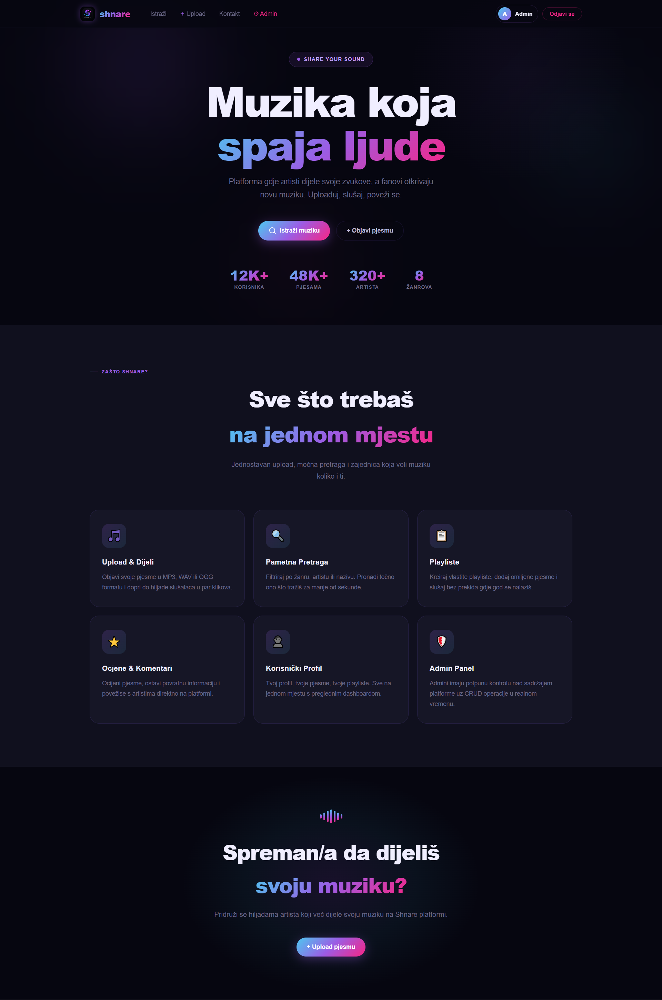
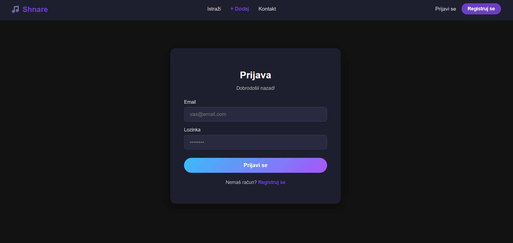
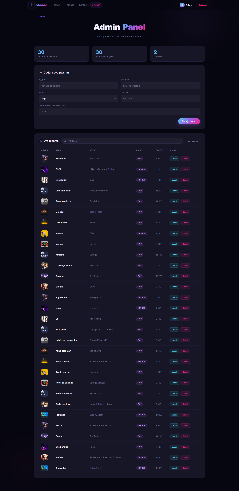

# music-sharing-platform

Projektni zadatak iz predmeta **Dizajn web stranica (DWS)** i **Operativni sistemi i računarstvo u oblaku (OSiRuO)** – Softversko inženjerstvo 2025/2026.

Platforma za dijeljenje i istraživanje muzike. Korisnici mogu pregledavati pjesme, uploadovati svoje, a administratori upravljati svim sadržajem.

---

## Tim

| GitHub | DWS doprinos | OSiRuO doprinos |
|--------|-------------|-----------------|
| [@hanajasarevic](https://github.com/hana-jasarevic) | Landing page, navigacija, registracija/prijava, Context API, `useAuth` custom hook, protected routes | Dockerfile za frontend (multi-stage, nginx) |
| [@adnasarvan](https://github.com/adna-sarvan) | Browse/pretraga muzike, upload forma, korisnički profil, 404 stranica, responsivan dizajn, animacije | Dockerfile za backend (json-server), docker-compose.yml, GitHub Actions, GCP setup, Cloud Run deployment |
| [@peratoviclamija](https://github.com/peratoviclamija) | Admin panel (CRUD), kontakt stranica + Google Maps, json-server setup, `useFetch` custom hook | health-check.sh skripta, README dokumentacija |

---

## Tech Stack

| Tehnologija | Verzija |
|-------------|---------|
| React | 18.x |
| React Router | 6.x |
| Tailwind CSS | 3.x |
| Node.js | 18.x |
| json-server | 0.17.x |
| Docker | 24.x |
| nginx | alpine |
| Google Cloud Run | - |

---

## Arhitekturni dijagram

```
┌─────────────────────────────────────────────┐
│              Korisnikov browser              │
└──────────────────┬──────────────────────────┘
                   │ HTTPS
        ┌──────────▼──────────┐
        │   Cloud Run         │
        │   Frontend (nginx)  │  :443
        │   React SPA         │
        └──────────┬──────────┘
                   │ HTTP API pozivi
        ┌──────────▼──────────┐
        │   Cloud Run         │
        │   Backend           │  :3001
        │   (json-server)     │
        └──────────┬──────────┘
                   │
        ┌──────────▼──────────┐
        │      db.json        │
        │   (baza podataka)   │
        └─────────────────────┘
```

---

## Paleta boja i fontovi

| Naziv | Hex | Upotreba |
|-------|-----|----------|
| Dark | `#0d0d14` | Pozadina aplikacije |
| Surface | `#16161f` | Kartice i paneli |
| Card | `#1c1c28` | Komponente |
| Purple | `#a855f7` | Primarna akcent boja |
| Blue | `#38bdf8` | Sekundarna akcent boja |
| Pink | `#ec4899` | Tercijarna akcent boja |
| Text | `#f1f0ff` | Glavni tekst |
| Muted | `#8888aa` | Sekundarni tekst |

**Font:** Inter (Google Fonts)

**Gradijent:** `linear-gradient(135deg, #38bdf8, #a855f7, #ec4899)`

---

## Korisničke uloge i prava pristupa

| Uloga | Prava |
|-------|-------|
| **Gost** (neprijavljen) | Pregled pjesama, pretraga, kontakt stranica |
| **Korisnik** (prijavljen) | Sve gostujuće + upload pjesama, korisnički profil |
| **Admin** | Sve korisničke + admin panel (CRUD sve pjesme) |

Autentifikacija je implementirana putem Context API i `useAuth` custom hooka. Admin rute su zaštićene `AdminRoute` komponentom koja provjerava `user.role === 'admin'`.

---

## Pokretanje projekta (lokalno)

### Preduslovi
- Node.js 18+
- npm

### 1. Kloniranje repozitorijuma

```bash
git clone https://github.com/adna-sarvan/music-sharing-platform.git
cd music-sharing-platform
```

### 2. Pokretanje backenda (json-server)

```bash
cd backend
npm install
npm start
```

Backend je dostupan na: `http://localhost:3001`

### 3. Pokretanje frontenda

```bash
cd frontend
npm install
npm run dev
```

Frontend je dostupan na: `http://localhost:5173`

### 4. Pokretanje sa Docker Compose

```bash
docker compose up --build
```

---

## Stranice

| Ruta | Stranica | Pristup |
|------|----------|---------|
| `/` | Landing Page | Svi |
| `/browse` | Browse muzike | Svi |
| `/login` | Prijava | Svi |
| `/register` | Registracija | Svi |
| `/upload` | Upload pjesme | Prijavljeni korisnici |
| `/profile` | Korisnički profil | Prijavljeni korisnici |
| `/admin` | Admin Panel | Samo admini |
| `/contact` | Kontakt + Google Maps | Svi |

---

## API Endpoints

| Metod | Endpoint | Opis |
|-------|----------|------|
| GET | `/songs` | Dohvati sve pjesme |
| GET | `/songs/:id` | Dohvati jednu pjesmu |
| POST | `/songs` | Dodaj novu pjesmu |
| PUT | `/songs/:id` | Ažuriraj pjesmu |
| DELETE | `/songs/:id` | Obriši pjesmu |

---

## Docker setup

### Dockerfile – Frontend (multi-stage)
Build stage koristi Node.js za `npm run build`, serve stage koristi nginx:alpine za posluživanje statičkih fajlova. Nginx je konfiguriran za React Router (`try_files`).

### Dockerfile – Backend
Koristi node:18-alpine kao base image. `db.json` je uključen u image.

### Pokretanje

```bash
# Lokalno pokretanje sa Docker Compose
docker compose up --build

# Frontend dostupan na: http://localhost:80
# Backend dostupan na: http://localhost:3001
```

---

## GCP Setup

### Korištene usluge
- **Artifact Registry** — čuvanje Docker imagea
- **Cloud Run** — serverless deployment kontejnera
- **IAM** — upravljanje pristupom

### Deployment komande

```bash
# Autentifikacija
gcloud auth login
gcloud config set project YOUR_PROJECT_ID

# Push imagea u Artifact Registry
docker build -t europe-west3-docker.pkg.dev/PROJECT_ID/shnare/frontend:latest ./frontend
docker push europe-west3-docker.pkg.dev/PROJECT_ID/shnare/frontend:latest

# Deploy na Cloud Run
gcloud run deploy frontend-service \
  --image europe-west3-docker.pkg.dev/PROJECT_ID/shnare/frontend:latest \
  --platform managed \
  --region europe-west3 \
  --allow-unauthenticated
```

---

## Health Check

```bash
chmod +x scripts/health-check.sh
bash scripts/health-check.sh
```

Skripta provjerava dostupnost frontend i backend servisa na produkcijskom URL-u, logira rezultat sa timestampom u `logs/health-check.log` i vraća exit kod 1 ako neki servis nije dostupan.

Primjer izlaza:
```
[2026-05-28 22:00:00] ========== Health Check Start ==========
[2026-05-28 22:00:01] OK - Frontend (Cloud Run) radi ispravno (HTTP 200) - URL: https://frontend-service-1024177687549.europe-west3.run.app
[2026-05-28 22:00:02] OK - Backend (Cloud Run) radi ispravno (HTTP 200) - URL: https://backend-service-1024177687549.europe-west3.run.app/songs
[2026-05-28 22:00:02] ========== Health Check End (greške: 0) ==========
```

---

## Produkcijski URL

> 🔗 **Frontend:** https://frontend-service-1024177687549.europe-west3.run.app
> 🔗 **Backend:** https://backend-service-1024177687549.europe-west3.run.app

---

## Screenshotovi

### Landing stranica


### Prijava


### Admin panel


---

## Refleksija tima

Tokom izrade projekta naučili smo kako integrirati frontend React aplikaciju sa json-server backendom, kako dockerizirati aplikaciju koristeći multi-stage build, te kako postaviti CI/CD pipeline putem GitHub Actions i Google Cloud Run. Najveći izazov bio je konfiguracija GCP IAM pristupa i Artifact Registry. U budućnosti bismo koristili pravu bazu podataka umjesto json-servera i dodali više sigurnosnih mehanizama.
